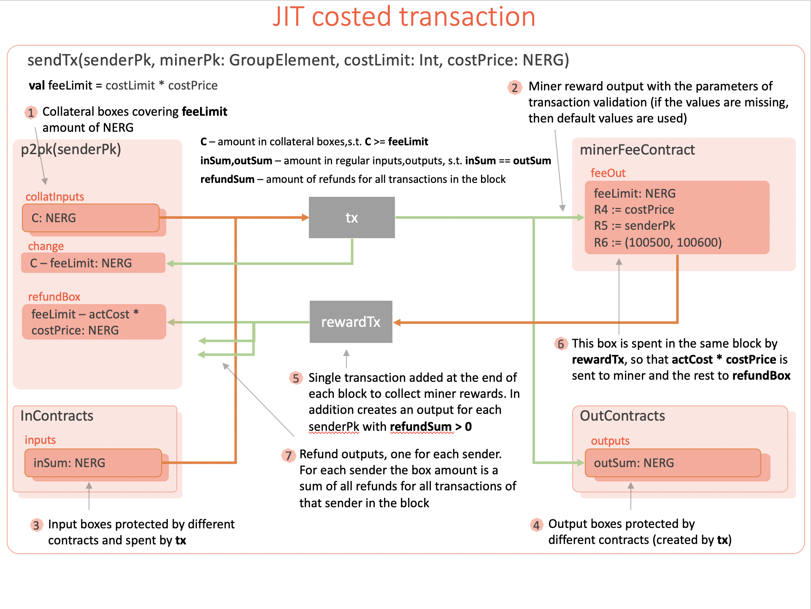

# Just-In-Time Costing (JIT costing)

* Author: aslesarenko 
* Status: Proposed
* Created: 10-Mar-2020
* License: CC0
* Forking: hard-fork needed 

### Contents
- [Background And Motivation](#background-and-motivation)
  - [AOT Costing](#aot-costing)
  - [JIT Costing](#jit-costing)
- [Ergo Transaction Validation With JIT Costing](#ergo-transaction-validation-with-jit-costing) 
  - [The Benefits of the JIT costing](#the-benefits-of-the-jit-costing) 
- [JIT costing of ErgoTree](#jit-costing-of-ergotree) 
- [Initial tests of transaction validity](#initial-tests-of-transaction-validity) 
- [Changes In The Reference Implementation](#changes-in-the-reference-implementation) 

### Background And Motivation

To prevent DoS attacks every
[script](https://github.com/ScorexFoundation/sigmastate-interpreter/blob/c31fa42adc8b752dcec2c440bb49474b51fad5f2/docs/spec/ergotree.pdf)
in the Ergo blockchain has to be executed with the control of the execution costs (aka
_costing_). This is necessary to prevent delayed validations of new block candidates by
the network nodes. Both over-sized and over-expensive scripts may be exploited to attack
the network.

There are two approaches to do cost control: 
1) Ahead-Of-Time (AOT) estimation of the execution costs, where the cost of the script is
estimated (in reality approximated) before and without the script execution.
2) Just-In-Time (JIT) cost accumulation during contract execution limited by some value.
(aka Gas limit in Ethereum)

#### AOT Costing

Current implementation of block validation in Ergo (performed by every full node) implements
the first approach (i.e. AOT costing) shown in the following figure.

This cost estimation happens for every
[ErgoTree](https://github.com/ScorexFoundation/sigmastate-interpreter/blob/c31fa42adc8b752dcec2c440bb49474b51fad5f2/docs/spec/ergotree.pdf)
of every input box of every transaction in a block.
The total accumulated costs of all the input ErgoTrees in the block is limited by the
`MaxBlockCost` parameter which can be adjusted by miners.

When a new block candidate is assembled by a miner the cost of running all input scripts
is calculated for each new transaction from the transaction pool.
The transaction is added to the block as long as the cost of all transactions in the block don't
exceed `MaxBlockCost` limit. When the cost is within the limit the transaction can be
added to the block candidate after it passes validation and all input ErgoTrees are
evaluated to `true`.

AOT cost estimation predicts the cost of the script execution ahead
of time in a given context. This approach is often used in blockchains with UTXO transaction
model and a simple, non-turing-complete contract language. 
The method work under assumption that cost estimation can be done much faster than
actual execution of the script. For non-turing-complete simple languages without looping
primitives, simple transaction context and only primitive types (like Bitcoin script) this
assumption is true. However for more complext languages like ErgoScript this is
increasingly not the case. The following is the list of limitations and drawbacks when the
AOT costing is applied to non-turing-complete (but still expressive language like ErgoScript).
 
##### Pros
1) No need to decide on the appropriate value for `gasLimit`
2) Transaction sender doesn't loose money in case the transaction is rejected due to exceeded cost. 
3) Simple user-centric economy, where user only need to pay the fixed transaction fee,
defined dynamically by the current network usage (supply/demand ratio).
 
##### Cons

1) Complexity. Simple implementation is only possible for simple language (i.e. primitive
types, no collections, simple transaction context (again, no collections). Adding
collection types with at least the `map` operation leads to a much more complex
implementation if we still want to have expressive enough language. The `fold` operation
is even worse for AOT costing unless we strictly limit it to primitive aggregations.

2) Poor approximation of cost. We don't know the exact execution trace of the script
ahead of time, in particular we cannot decide which branch of `if` statement will be
executed (since we don't know the result of condition expression). 
As a result we have to estimate both branches and take the maximum. This inherent estimation
error is multiplied when this `if` is part of the `map` operation. A similar approximation
has to be done if the script accesses an element of a collection by an index. If the
elements have complex structure (like INPUTS or OUTPUTS collections of boxes in
ErgoScript), then we have to approximate the size of the element we want to access. Even if
we abstract this size as just a number of bytes (which is very naive, and it didn't really
worked in ErgoScript), this number may lie in the range from hundred to 4K bytes. Thus we
may have an order of magnitude over-costing of the actual execution cost.

3) Very limited number of transaction in a block due to over-costing. It turns out that
poor cost approximation leads to over-costing. Because total cost of all transactions in a
block must not exceed `MaxBlockCost` we can put less transactions in the block which will
severely limit the network throughput in a long term.

4) To prevent rare spam attacks the miners need to do extra computations for executing
benign scripts. And complex implementation of AOT costing for expressive language and
transaction context makes this overhead comparable to or even exceed the execution of the
benign scripts themselves. Yes, we can quickly reject high-cost scripts, but have to pay
the double price for that everyday.

There are other technical difficulties, drawbacks and counter arguments for doing AOT
costing of contracts written in expressive language such as ErgoScript. However, the cons
list above should already be enough to motivate development of a better alternative, combining
advantage of both the extended UTXO model of Ergo and the simplicity of the JIT costing.

#### JIT Costing

A typical example of the JIT cost control is the Ethereum's `gasLimit` checks performed
during a transaction execution. 

Every transaction must specify a quantity of _"gas"_ that it
is willing to consume (called _startgas_), and the fee that it is willing to pay per unit
gas (_gasprice_). At the start of execution, `gasLimit * gasPrice` ether are removed from the
transaction sender's account. All operations during transaction execution and every
computational step taken by the virtual machine consumes a certain quantity of gas.

If a transaction execution processes fully, consuming less gas than its specified limit,
say with `gasRem` gas remaining, then the transaction executes normally, and at the end of
the execution the transaction sender receives a refund of `gasRem * gasPrice` and the miner
of the block receives a reward of `(gasLimit - gasRem) * gasPrice`. 

If a transaction "runs out of gas" mid-execution, then all execution reverts, but the
transaction is nevertheless valid, and the only effect of the transaction is to transfer
the entire sum `gasLimit * gasPrice` to the miner.

JIT costing has the following pros and cons.

##### Pros
1) Additional Economic incentive for miners to execute contract. The amount of purchase
from sender's account `(gasLimit - gasRem) * gasPrice` is payed to the miner, which
reflects the actual execution costs.
2) Simple implementation. Cost Table for all VM commands, accumulate the cost along an
execution trace.
3) Accurate approximation. Only actually executed operations are summed up. The execution
trace depends on the current state of the contract's data (i.e. current context) and
thus also the accumulated cost (i.e. `(gasLimit - gasRem)` value).
  
##### Cons
1) Transaction sender will loose funds in case of exceeding `gasLimit`. In a
turing-complete language of Ethereum VM (byte code instruction set) it may be hard to
choose appropriate `gasLimit` to associate with the transaction. This is in particular
due to the point 3) in the Pros list. As a result the transaction will be considered
invalid if actual (and unpredictably big) gas consumption exceeds `gasLimit`, in which
case the sender looses the funds.
2) The actual complexity of contracts may be limited by `gasPrice`.
Since all computations require gas, the complexity of contracts becomes limited by not
the language (which is powerful) and not the actual computation expenses of the miners, 
but by the current `gasPrice` asked by the miners. You would not want to spend more of your
funds for the gas required to execute a complex contract, than the amounts of funds you operate
with (i.e. sending $10 and pay $100 for the gas doesn't have economic sense).

### Ergo Transaction Validation With JIT Costing

Here we describe an extension to the existing Ergo protocol, which allows to prevent execution
of scripts beyond allotted limits. The extension doesn't require changes in the
serialization format. Moreover, simple _transfer transactions_ are processed the same way so
that 1) most existing applications (like exchanges) will not require any changes and 2)
the new protocol doesn't incur additional overhead for simple transfer transactions.
The cost calculation of ErgoTrees is implemented as it is defined in [the next
section](#jit-costing-of-ergotree).

On a high level, the new protocol for transaction creation, signing and validation is
described as a series of steps. The anatomy of the transactions which are created is shown
in the figure below.

 1) A transaction sender performs cost estimation as part of transaction signing.
Transaction signing involves: 1) execution of the scripts for all the input boxes and 2)
execution of sigma protocols to generate proofs. This happens using the current context of
the blockchain at the time of transaction signing, in particular current blockchain height
is used to execute scripts and may influence the outcome of the scripts. [JIT
costing](#jit-costing-of-ergotree) is performed during 1) and 2) steps resulting in the
value `estCost` to be produced. Note, if scripts execution doesn't depend on the current
blockchain parameters (like `HEIGHT`, `headers` etc.) then the `estCost` accurately
predicts execution costs in any context (i.e. `estCost == actCost`, see below). This is
because script execution depends only on `tx` content (which is immutable) and on nothing
else. For majority of scripts this is the case.

 2) The transaction sender must decide on the `costPrice` and `costLimit` values. The
 `costLimit` parameter is used by the miners to reject over-expensive transactions and
 should be greater or equal to `estCost` estimated during `tx` signing. The sender must
 put at least `feeLimit = costLimit * costPrice` NERGs (NanoERGs) in the miner's fee
 output box (see `feeOut` in the figure).
The sender in addition puts the following values in the registers of `feeOut` box ([see
footnote 2](#footnotes)):
    - R4: a `Long` value of `costPrice` which is equal to the number of NanoERG to be
    paid per unit of cost.
    - R5: a `senderPk` public key belonging to the sender. The ownership is proved
    during `tx` signing by spending at least one box protected by the `p2pk(senderPk)`
    contract.
    - R6: an interval of blockchain heights in which the transaction is valid, a pair
    of two Int values.
 
3) The transaction sender needs to convince miners that he has enough coins to pay for
transaction fees up to `feeLimit`. He can do it by showing enough boxes protected by
`p2pk(senderPk)` script corresponding to the public key stored in `feeOut.R5` register.
When `tx` has predictable cost (i.e. all input scripts have predictable cost and `estCost
== actCost`) then `feeLimit` is predictable and the sender puts enough inputs to cover it
(see `inputs` and `collatInputs` in the figure). The `collatInputs` boxes are put at the
tail of INPUTS collection, and the length of the tail is the smallest number of boxes to
cover `feeLimit`.

    However, when `actCost` is not predictable, which may happen when `tx` have different
    costs depending on the actual block (i.e. scripts have conditions on `HEIGHT`,
    `CONTEXT.headers`, etc), then the sender can choose a larger `costLimit` parameter to
    guarantee the transaction is not rejected as over-costed. In this case `feeLimit` may
    be much higher than `actCost * costPrice` and the sender will receive the `feeLimit -
    actCost * costPrice` amount of refund (see `refundBox` in the figure).
    
    The total value of NERGs in `collatInputs` must be greater or equal to `feeLimit`. The
    `change` output box is balancing the total amount in `collatInputs` with `feeLimit` (see
    the figure). The `inSum` amount of `inputs` boxes should be balanced with the `outSum`
    amount of `outputs` boxes. This balance should be independent of the balance of
    `collatInputs`. This is necessary when the transaction is interpreted as the _charge
    transaction_, in which case `inputs` are not spent and `outputs` are not created, so the
    effect on the UTXO still remains balanced.

    In an exceptional case of invalid transaction (due to the scripts returning false, or
    `actCost > feeLimit`) the transaction will still be added to the block but will be
    interpreted as a _charge transaction_ (see step 7 below).

4) A miner selects a new transactions from the pool using `feeLimit / costPrice` values in
`feeOut` box to quickly filter the transaction which fit into `MaxBlockCost`
limit. The transaction `tx` can be added to the block candidate if the currently accrued
block cost plus `costLimit` is less than `MaxBlockCost`. The `costLimit` value is obtained
using miner's fee output box (`feeOut`) as `costLimit = feeOut.value / feeOut.R4` (see
step 1).

5) The miner validates the selected transaction performing [initial tests of intrinsic
validity](#initial-tests-of-transaction-validity). If the transaction doesn't pass these
checks it is _malformed_ and the miner rejects it and removes from the pool. The sender is
not charged in this case. The well-formed transaction is further validated by executing
ErgoTrees for all inputs and verifying the corresponding proofs. The initial tests of
transaction validity have costs for miners, since they need to spend resources, but these
costs are not added to `actCost` value. The costs of the ErgoTree execution and the
subsequent proofs verification are [computed](#jit-costing-of-ergotree) as part of
spending validation and accrued to the `actCost`. When the validation proceeds from one
input to another the values of `actCost` and `costLimit` are passed to the ErgoTree
interpreter as parameters, so that the validation of the transaction fails immediately
after the current `actCost` exceeds `costLimit`. When is happens `tx` is further handled
as _over-limit_ transaction.

6) If the transaction is valid, the miner adds it to the block candidate and to the
`validTxs` list of the valid transactions along with an actual cost value `actCost`.  The
`validTxs` list is not stored in the blockchain, because it can be reproduced from a block
at any time. The `validTxs` list is used to create `refundTx` (see step 8) 

7) If the transaction is _well-formed_ but didn't pass the validation the miner still adds
it to the block, but it is interpreted in a special way as a _charge transaction_
(technically it is still the same `tx` transaction, only its effect on the UTXO is
changed). This is similar to how invalid transactions of Ethereum are interpreted. The
charge transaction has an effect of spending `feeLimit` from the sender's `collatInputs`
(owned by `senderPk` which is evidenced by providing signature for `senderPk` as part of
`tx` signing). The `inputs` boxes are not spent and the `outputs` boxes are not created.

    Because `tx` is well formed, it contains the necessary number of boxes in
    `collatInputs` to cover `feeLimit` in the output miner reward box `feeOut`.

    Note, when the charge transaction is validated by the other miners, they first
    validate it as a normal (valid) transaction `tx` of the block following steps 5) - 6).
    The other miners have to confirm the INvalidity of `tx`, after which they also
    interpret it as a charge transaction.

8) After the block candidate is full, the miner uses the `validTxs` list to create a
`rewardTx` and append it to the block (see the figure). The `rewardTx` spends all `feeOut`
boxes and creates 1) one output for the miner reward and 2) one output for each `senderPk`
whose transaction `tx` had actual `actCost < costLimit`, thus the `feeLimit - actCost *
costPrice` is sent to `senderPk` address (see the `refundBox` box in the figure). 

##### Footnotes
1) Cost estimation is a part of the existing proof generation in Ergo, but AOT costing
is used instead of JIT costing in version v1 of Ergo protocol.

2) A default `costPrice` can be used to make this register optional. The same is true for
other registers of `feeOut` box. This makes the new protocol compatible with existing
applications which send simple pay-to-pk address transactions.

3) The protocol penalize senders of the invalid transactions as long as the
transactions passes all intrinsic validation checks. This means the sender should be
charged if the transaction is invalidated due to scripts verification, which may be expensive. 
The sender should ensure, that the transaction inputs scripts can be verified in
any context where the transaction is intrinsically valid. For example tx can be
intrinsically invalid if it spends a box which has already been spent. The sender can
limit intrinsic validity of the transaction by specifying R6 register of `feeOut` box with 
valid height interval.

#### The Benefits of the JIT costing

1) A miner will never execute more operations for tx validation than it is payed in
miner's fee outputs, thus block validation costs are strictly limited by sum of fee
outputs and the miner's validation expenses are fully rewarded, no matter how complex the
script operations could be. This will enable easy long-term evolution of ErgoTree language
via soft-forks.

2) When selecting transactions from the pool, a miner can quickly filter out transactions
that doesn't fit into MaxBlockCost using `feeLimit / costPrice`.

3) In many cases (such as P2PK contracts and others) when the cost of transaction
validation doesn't depend on the context the cost of `tx` may be exactly predicted by the
sender. In such cases:
      - no refund outputs will be created for the transactions spending such "simple"
      boxes. Thus, the protocol doesn't have overhead in simple cases.
      - existing applications can be supported (without change) by using reasonable
      default values when the registers of `feeOut` box are not present.

4) The context independence of scripts and hence the exact prediction of `actCost` is a
static property of ErgoTree, it can be determined by analysing ErgoTree for which Context
properties the script uses. This can be controlled and enforced by the sender. Moreover,
it is possible to extend this property to a wider range of scripts by introducing a
_validity interval_ of a transaction (see the `R6` register of the `feeOut` box). This is
an interval of the blockchain heights during which the transaction can be processed. Thus,
any scripts which run during validation can assume that the current height is within that
interval, but do not rely on the precise value of the current height. This will make
`actCost` exactly predictable even for scripts what have conditions on `HEIGHT` (like
`HEIGHT > deadline`).

5) A block represents a trace of UTXO state changes. Thus depending on a transaction
validity, either the transaction signed by the sender represents standard (normal) state
modifications, or the invalid `tx` is interpreted differently as _charge transaction_ thus
representing different changes in UTXO. This choice is fully deterministic for all
transactions and thus all validating nodes have a consensus about state changes.

6) In a long term, JIT costing enables an economic incentive to improve performance of
block validation including script evaluation. The miners are interested to put as much
transactions in every block as possible to maximize fee payments.
Considering the pool is full of transactions, the amount of transactions which can be put
into a new block is limited by two parameters:
      - Block validation time is limited by 2 minutes tick interval between blocks (which
      BTW should be adjustable via voting). The time budget for block assembly and
      validation itself is the fraction of this time (say 30 seconds), as the block must
      also be distributed across the network and validated by all nodes. This is necessary
      to avoid network splits.
      - The maximum number of transactions in a block is limited by the `MaxBlockCost`
      network parameter. This parameter can be increased by miners via voting (practically
      indefinitely), as long as the resulting blocks don't exceed the validation time
      limit.

Under these limits, miners as a community, are interested to improve throughput of block
assembly and validation software to process more transactions per second, with higher
total cost within the given time limits. The proposed JIT costing protocol for extended
UTXO model of Ergo enables a whole range of potential optimizations. This will be
especially important when the emission is over and the transaction fees along with storage
rent will be the only reward for miners.

### JIT costing of ErgoTree

Ethereum contracts are compiled to bytecode instructions, which are then executed by
Ethereum VM as part of a transaction execution. Each instruction has an associated cost (aka
'gas') and the cost of the whole transaction is accrued as instructions are executed one
by one until either transaction finishes of gasLimit is reached, in which case the
transaction is aborted and the `gasLimit * gasPrice` number of Wei is transferred to the
miner.

In contrast, Ergo doesn't use VM to execute contracts which protect boxes. The contract in
Ergo is stored as serialized _typed abstract syntax tree_ (ErgoTree). The bytes of the
contract are deserialized into ErgoTree data structure. 

ErgoTree is designed for direct and efficient execution by the
interpreter using a Context data structure to access the blockchain data. The interpreter
doesn't have direct access to the blockchain, and rely only on the Context to execute ErgoTree.
The original interpreter of the language is extended to
accumulate the execution cost during evaluation of ErgoTree. Thus when the interpreter 
finishes the execution of ErgoTree, the result is a pair `(R,C)`, where `R` is true/false
boolean value and `C` is the cost accumulated during execution of `R`. If however during
the execution of ErgoTree the accumulated cost exceeds at some point the `costLimit`
value, then exception is thrown, which is interpreted as over-expensive script.

An algorithm for execution of ErgoTree with JIT cost estimation is described in [ErgoTree
Specification](https://ergoplatform.org/docs/ergotree.pdf).

### Initial tests of transaction validity

This conditions should be checked for every well-formed transaction.

- All checks performed in the current Ergo Protocol (v1 at the time of writing)
- INPUTS contain at least one `p2pk(senderPk)` box
- current height is within `feeOut.R6` interval
- the `sum(collatInputs) + change == feeLimit` 

### Changes In The Reference Implementation

- rewrite transaction
- cost model is required for initial checks (the cost contributing to MaxBlockLimit)
- implement voting for the time interval between blocks
- voting for individual parameters of the cost model
- remove `EQ(SizeOf(Outputs), 1)` from `ErgoScriptPredef.feeProposition`. Instead
transaction validation should validate the content of the `rewardTx`, in particular 
that all the necessary refund boxes are created.

### Implementation of the Hard-Fork on Ergo network

JIT costing (JITC pronounced "jitsy") can only be activated via hard-fork. It is not
possible to ensure that JITC always produces the same costs as AOTC by changing CostTable
parameters. This is because JITC is accurately accumulates the actual operations' cost and
AOTC is approximating both data sizes and speculating on potential costs in case of
branching logic.

#### Phase 1: Release v4.0.0.

##### Selection of hard-forking block

  In this first HF release both AOTC and JITC code will be available. AOTC will be
  operational until HF voting is finished and HF switch is performed. The full nodes vote
  for HF by running v4.0.0 release (which imply voting). Every node can check the voting
  status using Block Extension section. Once the necessary voting threshold is achieved
  (`HFVoted` status) in an epoch, the first block of the next epoch is the first hard-forked
  block, we will refer to it as `HFBlock`.
  
  It is important to ensure that JITC is functionally equivalent to AOTC for all the
  blocks in `[1 .. HFBlock-1]` range. Here functional equivalence means that for each script
  both AOTC and JITC should evaluate to the same result.
  This property is necessary to remove the old v3.x ErgoTree interpreter and perform the
  validation of historical blocks using the JITC interpreter alone. Since the history is
  immutable, it is enough to check the equivalence by running both v3.x interpreter and
  JITC on all the blocks up until `HFBlock`.
  
  Thus, all v4.0.0 nodes will run JITC interpreter in parallel with AOTC and compare the
  results. If at any time the script results are different, then AOTC result is used in
  the consensus and the problematic transaction is logged. In addition the voting
  is blocked, by the node. If AOTC validates the problematic transaction it still should
  be added to the blockchain to support current consensus among v4.0.0 and older nodes. 
  This will lead to all v4.0.0 nodes stop voting, thus preventing the HF switch. 
  
  If voting is blocked (which is exceptional case), then a fix in JITC is required, so new
  v4.0.1 release should be create and the HF process should start from scratch.
  
  If voting is not blocked and `HFVoted` network status is achieved, then majority of
  nodes are running v4.0.0 version. In this case the validation of the first block after
  `HFVoted` (let's call it `HFVotedBlock`) require both AOTC and JITC have strictly the
  same result. Transactions which invalidate this property should be rejected by all
  v4.0.0 nodes (which are now the majority). This will ensure that in the block range
  `[HFVotedBlock .. HFBlock]` AOTC and JITC are functionally equivalent.
   
  
##### Switching AOTC to JITC

  When voting is not blocked, `HFVoted` status is achieved and `HFBlock` is selected then
  all the v4.0.0 nodes need to switch from AOTC to JITC starting from `HFBlock`.
  This switch is implemented as an `if` statement in the block validation code of v4.0.0
  release.
  
  Thus, starting from `HFBlock`, JITC is used for all new block validation and AOTC is
  turned-off (the code is not executed) and the network is operating according to a new
  consensus (Ergo Protocol v2).
  Now, because the v2 consensus is based on JITC there is an opportunity to fix bugs and
  add new features to ErgoTree, which are all enabled starting from `HFBlock`. 
  
  NOTE, both fixes and new features should keep backward compatibility of applications in
  mind.
  
  The fixes in JITC for v2 protocol, however, may be not compatible with v1 protocol. 
  This will require JITC interpreter to have an internal branching logic having both
  versions of the protocol. Thus JITC v4.0.0 will process historical blocks according to
  Ergo Protocol v1 and starting from `HFBlock` as Ergo Protocol v2. This will ensure, that
  each v4.x release will successfully validate all historical blocks.
  
#### Phase 2: Release v4.0.1 (removing AOTC)

  This version can be released after `HFBlock` and should include JITC supporting
  ErgoProtocol v1 and v2. The main goal of this release is to remove  v3.x AOTC ErgoTree
  interpreter from the code to simplify reference implementation.
  
  Update of the node to v4.0.1 shouldn't require node re-sync. For new nodes joining the
  network, v4.0.1 will use JITC to validate both historical and new blocks. This is
  possible since AOTC is conservative/pessimistic in estimating actual script costs. Thus,
  JITC can relax script costs 2-3x so that all the historical blocks which are valid under
  AOTC can also be valid under JITC. Thus, JITC will never invalidate historical blocks
  due to costing and other invalidation reasons were prevented on the Phase 1 (by checking
  functional equivalence).
  
  Together with removed AOTC code, the HF switching condition can be simplified. Starting
  from v4.0.1 release it can be based on using the known `HFBlock` constant in the code.
  Switching based on hard-fork voting and `HFVoted` status is no-longer necessary and can
  be disabled. The HF activation code itself, however, can be reused in the next HF voting
  and activation.

#### Hard-Fork Voting Implementation

