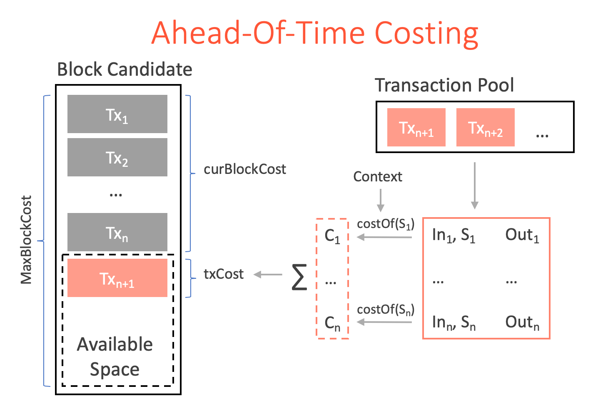

# Just-In-Time Costing (JIT costing)

* Author: aslesarenko 
* Status: Proposed
* Created: 10-Mar-2020
* License: CC0
* Forking: hard-fork needed 

## Contents
- [Background And Motivation](#background-and-motivation)
- [Ergo Transaction Validation With JIT Costing](#ergo-transaction-validation-with-jit-costing) 
  - [Transaction Verification](#transaction-verification)
  - [Sending Transaction](#sending-transaction)
  - [Context-Independent Scripts](#context-independent-scripts) 
  - [JIT costing of ErgoTree](#jit-costing-of-ergotree) 
- [Implementation of the Hard-Fork on Ergo network](#implementation-of-the-hard-fork-on-ergo-network)
  - [Phase 1: Release v4.0.0](#phase-1-release-v400)
  - [Phase 2: Release v4.0.1 (removing AOTC)](#phase-2-release-v401-removing-aotc)
- [References](#references)
- [Appendix A: AOT vs JIT Costing](#appendix-a-aot-vs-jit-costing)
  - [AOT Costing](#aot-costing)
  - [JIT Costing](#jit-costing)
- [Appendix B: Benefits of JIT costing](#appendix-b-benefits-of-jit-costing)

## Background And Motivation

To prevent DoS attacks every script in the Ergo blockchain (represented as
[ErgoTree](https://ergoplatform.org/docs/ErgoTree.pdf)) has to be executed with the
control of the execution costs (aka _costing_). This is necessary to prevent delayed
validations of new block candidates by the network nodes. Both over-sized and
over-expensive scripts may be exploited to attack the network by exhausting verifiers'
resources.

There are two approaches to do cost control: 
1) Ahead-Of-Time costing (AOTC) - an estimation of the execution costs, where the cost of
the script is approximated before and without the script execution.
2) Just-In-Time costing (JITC) - cost accumulation during contract execution limited by
some value. (aka Gas limit in Ethereum)

## Ergo Transaction Validation With JIT Costing

This EIP describes JIT costing (JITC), which allows to prevent execution of scripts beyond
allotted limits. The JITC implementation doesn't require changes in the serialization
format. Moreover, all transactions on the protocol level are processed the same way so
that 1) all existing applications (like exchanges, ErgoMix, DEX) will not require any
changes and 2) the new protocol doesn't incur additional overhead. The cost calculation of
ErgoTrees is implemented as it is defined in [the next section](#jit-costing-of-ergotree).

We first describe how transactions of block are validated. This validation is part of the
consensus protocol. Transaction validation is deterministic procedure which should be the
same for all nodes of the network.
Next, we describe the steps which should be done _off-chain_ by applications in order to
create, sign and send new transactions.

### Transaction Verification

The verification is performed by _verifier_ nodes for each new transaction `tx` either
selected from the pool or contained in a new block candidate.

1) A verifier determines the `costLimit` parameter of the transaction which should be less
than `MaxTxCost`. The limit is computed as `costLimit = tx.feeOut.value /
tx.feeOut.R4[Long]` if the register is not empty, otherwise `costLimit = MaxTxCost`.

2) The transaction `tx` can be added to the block candidate if the currently accrued block
cost `blk.accCost` plus `costLimit` is less than `MaxBlockCost`. Validation of the
block fails immediately after the current `blk.accCost` exceeds `MaxBlockCost`.

3) The verifier validates `tx` performing all the checks of the current Ergo Protocol (v1 at
the time of writing) except verification of scripts and proofs. If the transaction doesn't
pass these checks it is _malformed_ and the verifier rejects it. 

4) All operations performed by the verifier have an associated costs. These costs are
accumulated to the `tx.accCost` parameter and shouldn't exceed `costLimit`. The
`tx.accCost <= costLimit` check is performed every time `tx.accCost` is increased. When
the limit is exceeded the verification is aborted and `tx` is rejected as
_over-limit_ transaction.

5) The initial checks of transaction validity have a cost for miners, since miners need to
spend resources. The cost is accrued to the total transaction cost `tx.accCost`. If the
initial checks pass the transaction is _well-formed_ otherwise the transaction is rejected.

6) The well-formed transaction is further validated by executing ErgoTrees for all inputs
and verifying the corresponding proofs. The costs of the ErgoTree execution and the
subsequent proofs verification are [computed](#jit-costing-of-ergotree) as part of script
evaluation and accrued to the `tx.accCost`. When the validation proceeds from one input to
another the values of `tx.accCost` and `costLimit` are passed to the ErgoTree interpreter
as parameters, so that the validation of the transaction fails immediately after the
current `tx.accCost` exceeds `costLimit`. When it happens `tx` is rejected as
_over-limit_ transaction.

7) If the transaction is successfully verified, the actual cost value
`tx.accCost` is accrued towards `MaxBlockCost` limit. If the transaction is rejected then: 
1) If the verification is part of a new block candidate assembly the `tx` is dropped. 
2) If the verification is part of a block verification the whole block is also rejected. 

### Sending Transaction

Step 1
A transaction sender performs cost estimation as part of transaction signing.
Transaction signing involves: 
   1) Execution of the scripts for all the input boxes.
   2) Execution of sigma protocols to generate proofs. 
  
The above two steps are performed using the current context of the blockchain at the
time of transaction signing. In general, the current blockchain height, PreHeader and
the last 10 block headers can be used in the scripts which may influence the result of
the scripts.
  
[JIT costing](#jit-costing-of-ergotree) is performed during script execution resulting in
the value `estCost` to be produced, which is the estimated cost of executing the script in
the given blockchain context.

Note, if scripts execution doesn't depend on the current blockchain parameters (like
`HEIGHT`, `headers` etc.) then `estCost` deterministically predicts execution cost in
_any_ context (see [context-independent scripts](#context-independent-scripts)). In this
case the sender doesn't need to choose `costPrice` and `costLimit` parameters mentioned
below. The parameters can be computed automatically by the software. This means
_context-independent_ scripts are easier for dApps because the cost control is completely
transparent.

When the transaction has a script which _depends_ on the context then the transaction
sender can _optionally_ decide to specify the `costPrice` parameter of . The
`costLimit` parameter is used by the miners to reject over-expensive transactions and
should be greater or equal to `estCost` estimated during `tx` signing. The sender can
_optionally_ put at least `feeLimit = costLimit * costPrice` NERGs (NanoERGs) in the
miner's fee output box (see `feeOut` in the figure). The sender in addition can
_optionally_ put the following value in the `R4` register of `feeOut` box ([see footnote
2](#footnotes)):
    - R4: a `Long` value of `costPrice` which is equal to the number of NanoERG to be
    paid per unit of cost.
 
3) The transaction sender needs to convince miners that he has enough coins to pay for
transaction fees up to `feeLimit`. He can do it by showing enough boxes protected by
`p2pk(senderPk)` script corresponding to the public key stored in `feeOut.R5` register.
When `tx` has predictable cost (i.e. all input scripts are context-independent and
`estCost == actCost`) then `feeLimit` is predictable and the sender puts enough inputs to
cover it (see `inputs` and `collatInputs` in the figure). The `collatInputs` boxes are put
at the tail of INPUTS collection, and the length of the tail is the smallest number of
boxes to cover `feeLimit`.

    However, when `actCost` is not predictable, which may happen when `tx` have different
    costs depending on the actual block (i.e. at least one script is context-dependent and
    have conditions on `HEIGHT`, `CONTEXT.headers`, etc), then the sender can choose a
    larger `costLimit` parameter to guarantee the transaction is not rejected as
    over-costed. In this case `feeLimit` may be much higher than `actCost * costPrice` and
    the sender will receive the `feeLimit - actCost * costPrice` amount of refund (see
    `refundBox` in the figure).
    
    The total value of NERGs in `collatInputs` must be greater or equal to `feeLimit`. The
    `change` output box is balancing the total amount in `collatInputs` with `feeLimit` (see
    the figure). The `inSum` amount of `inputs` boxes should be balanced with the `outSum`
    amount of `outputs` boxes. This balance should be independent of the balance of
    `collatInputs`. This is necessary when the transaction is interpreted as the _charge
    transaction_, in which case `inputs` are not spent and `outputs` are not created, so the
    effect on the UTXO still remains balanced.

    In an exceptional case of invalid transaction (due to the scripts returning false, or
    `actCost > feeLimit`) the transaction will still be added to the block but will be
    interpreted as a _charge transaction_ (see step 7 below).

### Context-Independent Scripts

There is a large class of scripts which execution doesn't depend on the blockchain context
parameters (like `HEIGHT`, last `headers` etc.) (see references [[1]](#references)).  
For such _context-independent_ scripts the execution depends only on `tx` content (which
is immutable) and on nothing else. 

The "context independence" property of the script can be checked during de-serialisation
or by a single traverse of the ErgoTree. This can be done both _off-chain_ (in the client
side dApp) and _on-chain_ in the Ergo node by simply checking that the tree doesn't contain
forbidden (context related) operations.

Thus, if the dApp uses such "context independent" contracts, then it can predictably (and
deterministically) compute the `tx.accCost` value of of verification cost of the
transaction, in which case neither the client nor the network bear the risks of
unexpectedly costly transaction execution and subsequent rejection by the network (wasting
time and resources). Note, the cost is computed as part of the transaction signing, which
should be done in any case. 

Thus an application can: 
  1) Evaluate scripts and obtain `tx.accCost` value.
  2) Choose `costPrice` value and store it in `tx.feeOut.R4`.
  3) Compute `tx.feeOut.value = tx.accCost * costPrice`.
  4) Sign the transaction and send it to the network.
  
Because all the scripts depend only on the transaction content, every verifier will always
finish `tx` verification with the same `tx.accCost` value. This means the transaction will
never be rejected as _over-limit_. This mechanism is transparent for the client dApp
implementation and no special ceremony has to be performed by the application.

### JIT costing of ErgoTree

Ethereum contracts are compiled to bytecode instructions, which are then executed by
Ethereum VM as part of a transaction execution. Each instruction has an associated cost
(aka 'gas') and the cost of the whole transaction is accrued as instructions are executed
one by one until either transaction finishes or `gasLimit` is reached, in which case the
transaction is aborted and the `gasLimit * gasPrice` number of Wei is transferred to the
miner.

In contrast, Ergo doesn't use VM to execute contracts which protect boxes. The contract in
Ergo is stored as serialized _typed abstract syntax tree_ (ErgoTree). The bytes of the
contract are deserialized into ErgoTree data structure. 

ErgoTree is designed for direct and efficient execution by the interpreter using a Context
data structure to access the blockchain data. The interpreter doesn't have direct access
to the blockchain, and rely only on the Context to execute ErgoTree.

The interpreter of the ErgoTree `t` is extended to accumulate the execution cost
`t.accCost` during evaluation and it checks that `t.accCost <= costLimit`. Thus when the
interpreter finishes execution of ErgoTree, the result is a pair `(R,C)`, where `R` is
true/false boolean value and `C` is the cost accumulated during execution. If however
during the execution of ErgoTree the accumulated cost `t.accCost` exceeds at some point
the `costLimit` value, then exception is thrown, which is interpreted as _over-limit
script_.

An algorithm for execution of ErgoTree with JIT cost estimation is described in [ErgoTree
Specification](https://ergoplatform.org/docs/ergotree.pdf).

## Implementation of the Hard-Fork on Ergo network

JIT costing (JITC pronounced "jitsy") can only be activated via hard-fork. It is not
possible to ensure that JITC always produces the same costs as AOTC by changing CostTable
parameters. This is because JITC is accurately accumulates the actual operations' cost and
AOTC is approximating both data sizes and speculating on potential costs in case of
branching logic.

#### Phase 1: Release v4.0.0.

##### Selection of hard-forking block

  In this first HF release both AOTC and JITC code will be available. AOTC will be
  operational until HF voting is finished and HF switch is performed. The full nodes vote
  for HF by running v4.0.0 release (which imply voting). Every node can check the voting
  status using Block Extension section. Once the necessary voting threshold is achieved
  (`HFVoted` status) in an epoch, the first block of the next epoch is the first hard-forked
  block, we will refer to it as `HFBlock`.
  
  It is important to ensure that JITC is functionally equivalent to AOTC for all the
  blocks in `[1 .. HFBlock-1]` range. Here functional equivalence means that for each script
  both AOTC and JITC should evaluate to the same result.
  This property is necessary to remove the old v3.x ErgoTree interpreter and perform the
  validation of historical blocks using the JITC interpreter alone. Since the history is
  immutable, it is enough to check the equivalence by running both v3.x interpreter and
  JITC on all the blocks up until `HFBlock`.
  
  Thus, all v4.0.0 nodes will run JITC interpreter in parallel with AOTC and compare the
  results. If at any time the script results are different, then AOTC result is used in
  the consensus and the problematic transaction is logged. In addition the voting
  is blocked, by the node. If AOTC validates the problematic transaction it still should
  be added to the blockchain to support current consensus among v4.0.0 and older nodes. 
  This will lead to all v4.0.0 nodes stop voting, thus preventing the HF switch. 
  
  If voting is blocked (which is exceptional case), then a fix in JITC is required, so new
  v4.0.1 release should be create and the HF process should start from scratch.
  
  If voting is not blocked and `HFVoted` network status is achieved, then majority of
  nodes are running v4.0.0 version. In this case the validation of the first block after
  `HFVoted` (let's call it `HFVotedBlock`) require both AOTC and JITC have strictly the
  same result. Transactions which invalidate this property should be rejected by all
  v4.0.0 nodes (which are now the majority). This will ensure that in the block range
  `[HFVotedBlock .. HFBlock]` AOTC and JITC are functionally equivalent.
   
  
##### Switching AOTC to JITC

  When voting is not blocked, `HFVoted` status is achieved and `HFBlock` is selected then
  all the v4.0.0 nodes need to switch from AOTC to JITC starting from `HFBlock`.
  This switch is implemented as an `if` statement in the block validation code of v4.0.0
  release.
  
  Thus, starting from `HFBlock`, JITC is used for all new block validation and AOTC is
  turned-off (the code is not executed) and the network is operating according to a new
  consensus (Ergo Protocol v2).
  Now, because the v2 consensus is based on JITC there is an opportunity to fix bugs and
  add new features to ErgoTree, which are all enabled starting from `HFBlock`. 
  
  NOTE, both fixes and new features should keep backward compatibility of applications in
  mind.
  
  The fixes in JITC for v2 protocol, however, may be not compatible with v1 protocol. 
  This will require JITC interpreter to have an internal branching logic having both
  versions of the protocol. Thus JITC v4.0.0 will process historical blocks according to
  Ergo Protocol v1 and starting from `HFBlock` as Ergo Protocol v2. This will ensure, that
  each v4.x release will successfully validate all historical blocks.
  
#### Phase 2: Release v4.0.1 (removing AOTC)

  This version can be released after `HFBlock` and should include JITC supporting
  ErgoProtocol v1 and v2. The main goal of this release is to remove  v3.x AOTC ErgoTree
  interpreter from the code to simplify reference implementation.
  
  Update of the node to v4.0.1 shouldn't require node re-sync. For new nodes joining the
  network, v4.0.1 will use JITC to validate both historical and new blocks. This is
  possible since AOTC is conservative/pessimistic in estimating actual script costs. Thus,
  JITC can relax script costs 2-3x so that all the historical blocks which are valid under
  AOTC can also be valid under JITC. Thus, JITC will never invalidate historical blocks
  due to costing and other invalidation reasons were prevented on the Phase 1 (by checking
  functional equivalence).
  
  Together with removed AOTC code, the HF switching condition can be simplified. Starting
  from v4.0.1 release it can be based on using the known `HFBlock` constant in the code.
  Switching based on hard-fork voting and `HFVoted` status is no-longer necessary and can
  be disabled. The HF activation code itself, however, can be reused in the next HF voting
  and activation.

#### Hard-Fork Voting Implementation
  TODO
  
### References

[1] The Extended UTXO Model. 
    Manuel Chakravarty,James Chapman,Kenneth MacKenzie,Orestis Melkonian,Michael Peyton Jones,Philip Wadler
    January/2020, Workshop on Trusted Smart Contracts (Financial Cryptography 2020)
    
[2] Demystifying Incentives in the Consensus Computer. 
    Luu, Loi & Teutsch, Jason & Kulkarni, Raghav & Saxena, Prateek. (2015). 706-719.
   
## Appendix A: AOT vs JIT Costing

### AOT Costing
Current implementation of block validation in Ergo (performed by every full node) implements
the first approach (i.e. AOT costing) shown in the following figure.

This cost estimation happens for every
[ErgoTree](https://ergoplatform.org/docs/ErgoTree.pdf) of every input box of every
transaction in a block. The total accumulated costs of all the input ErgoTrees in the
block is limited by the `MaxBlockCost` parameter which can be adjusted by miners.

When a new block candidate is assembled by a miner the cost of running all input scripts
is calculated for each new transaction from the transaction pool.
The transaction is added to the block as long as the cost of all transactions in the block don't
exceed `MaxBlockCost` limit. When the cost is within the limit the transaction can be
added to the block candidate after it passes validation and all input ErgoTrees are
evaluated to `true`.

AOT cost estimation predicts the cost of the script execution ahead
of time in a given context. This approach is often used in blockchains with UTXO transaction
model and a simple, non-turing-complete contract language. 
The method work under assumption that cost estimation can be done much faster than
actual execution of the script. For non-turing-complete simple languages without looping
primitives, simple transaction context and only primitive types (like Bitcoin script) this
assumption is true. However for more complex languages like ErgoTree this is
increasingly not the case. The following is the list of limitations and drawbacks when the
AOT costing is applied to non-turing-complete (but still expressive language like ErgoScript).
 
##### AOTC Pros
1) No need to decide on the appropriate value for `gasLimit`
2) Transaction sender doesn't loose money in case the transaction is rejected due to the exceeded cost. 
3) Simple user-centric economy, where user only need to pay the fixed transaction fee,
defined dynamically by the current network usage (supply/demand ratio).
 
##### AOTC Cons

1) _It is complex_. Simple implementation is only possible for simple language (i.e.
primitive types, no collections, simple transaction context (again, no collections).
Adding collection types with at least the `map` operation leads to a much more complex
implementation if we still want to have expressive enough language. The `fold` operation
is even worse for AOT costing unless we strictly limit it to primitive aggregations.

2) _It is in accurate_. We don't know the exact execution trace of the script
ahead of time, in particular we cannot decide which branch of `if` statement will be
executed (since we don't know the result of condition expression) when the condition
depends on blockchain context such as current block height.
As a result we have to estimate both branches and take the maximum. This inherent estimation
error is multiplied when this `if` is part of the `map` operation. A similar approximation
has to be done if the script accesses an element of a collection by an index. If the
elements have complex structure (like INPUTS or OUTPUTS collections of boxes in
ErgoScript), then we have to approximate the size of the element we want to access. Even if
we abstract this size as just a number of bytes (which is very naive, and it didn't really
worked in ErgoScript), this number may lie in the range from hundred to 4K bytes. Thus we
may have an order of magnitude over-estimation of the actual execution cost (or
underestimation if we decide to use optimistic approximation).

3) _Low scalability_. Very limited number of transaction in a block due to
over-estimation. It turns out that poor cost approximation leads to over-estimation.
Because total cost of all transactions in a block must not exceed `MaxBlockCost` we can
put less transactions in the block which severely limits the maximum possible network
throughput.

4) _High overhead_. To prevent rare spam attacks the miners need to do extra computations
for executing benign scripts. And complex implementation of AOT costing (for expressive
ErgoTree language and transaction context) makes this overhead comparable to or even
exceeding the execution of the benign scripts themselves. Yes, we can quickly reject
high-cost scripts, but have to pay the double price for that everyday.

There are other technical difficulties, drawbacks and counter arguments for doing AOT
costing of contracts written in expressive language such as ErgoTree. However, the cons
list above should already be enough to motivate development of a better alternative,
combining advantage of both the extended UTXO model of Ergo and the simplicity of the JIT
costing.

### JIT Costing

An example of the JIT cost control (also called _dynamic_ cost control) is the Ethereum's
`gasLimit` checks performed during a transaction execution.

In Ethereum, every transaction must specify an amount of _"gas"_ that it is willing to
consume (called _gasLimit), and the fee that it is willing to pay per unit gas
(_gasPrice_). At the start of the transaction execution `gasLimit * gasPrice` of Ether are
removed from the transaction sender's account. All operations during transaction execution
and every computational step taken by the virtual machine consumes a certain quantity of
gas.

If a transaction execution processes fully, consuming less gas than its specified limit,
say with `gasRem` gas remaining, then the transaction executes normally, and at the end of
the execution the transaction sender receives a refund of `gasRem * gasPrice` and the miner
of the block receives a reward of `(gasLimit - gasRem) * gasPrice`. 

If a transaction "runs out of gas" mid-execution, then all execution reverts, but the
transaction is nevertheless valid, and the only effect of the transaction is to transfer
the entire sum `gasLimit * gasPrice` to the miner.

JIT costing has the following pros and cons.

##### JITC Pros
1) Additional Economic incentive for miners to execute contracts. The amount of purchase
from sender's account `(gasLimit - gasRem) * gasPrice` is payed to the miner, which
reflects the actual script execution costs.
2) Simple implementation using Cost Table for all VM commands and accumulation of the cost
along the execution trace.
3) Accurate approximation. Only actually executed operations are summed up. The execution
trace depends on the current state of the contract's data (i.e. current context) and
thus also the accumulated cost (i.e. `(gasLimit - gasRem)` value).
  
##### JITC Cons
1) Transaction sender will loose funds in case of exceeding `gasLimit`. In a
turing-complete language of Ethereum VM (byte code instruction set) it may be hard to
choose appropriate `gasLimit` to associate with the transaction. This is in particular
due to the point 3) in the Pros list. As a result, the transaction will be considered
invalid if actual (and unpredictably big) gas consumption exceeds `gasLimit`, in which
case the sender looses the funds.
2) The actual complexity of contracts may be limited by `gasPrice`.
Since all computations require gas, the usability of the contracts becomes limited by not
the language (which is powerful) and not the actual computation expenses of the miners, 
but by the current `gasPrice` asked by the miners. You would not want to spend more of your
funds for the gas required to execute a complex contract, than the amounts of funds you operate
with (i.e. sending $10 and pay $100 for the gas doesn't have economic sense).
    
    
## Appendix B: Benefits of JIT costing

1) When selecting transactions from the pool, a miner can quickly filter out transactions
that doesn't fit into MaxBlockCost using `costLimit = tx.feeOut.value / tx.feeOut.R4` when
R2 is specified.

2) In many cases (such as P2PK contracts and others) when the cost of transaction
validation doesn't depend on the context the cost of `tx` may be exactly predicted by the
sender (see [Context-Independent Scripts](#context-independent-scripts). 
In such cases:
  - no over-limit transactions will be rejected thus, the protocol doesn't have overhead
  in simple cases.
  - existing applications can be supported (without change) by using reasonable and small
  default values of `costLimit` when the registers of `feeOut` box are not present (rather
  than using pessimistic `MaxTxCost` as default of `costLimit`).

3) In a long term, JIT costing enables an economic incentive to improve performance of
block validation including script evaluation. The miners are interested to put as much
transactions in every block as possible to maximize fee payments.
Considering the pool is full of transactions, the amount of transactions which can be put
into a new block is limited by two parameters:
      - Block validation time is limited by 2 minutes tick interval between blocks. The
      time budget for block assembly and validation itself is the small fraction of this time
      (less than 5 seconds), as the block must also be distributed across the network and
      validated by all nodes. This is necessary to avoid network splits.
      - The maximum number of transactions in a block is limited by the `MaxBlockCost`
      network parameter. This parameter can be adapted by miners via voting, as long as
      the resulting blocks don't exceed the validation time limit.

Under these limits, miners as a community, are interested to improve throughput of block
assembly and validation software to process more transactions per second, with higher
total cost within the given time limits. The proposed JIT costing protocol for extended
UTXO model of Ergo enables a whole range of potential optimizations. This will be
especially important when the emission is over and the transaction fees along with storage
rent will be the only reward for miners.

 
