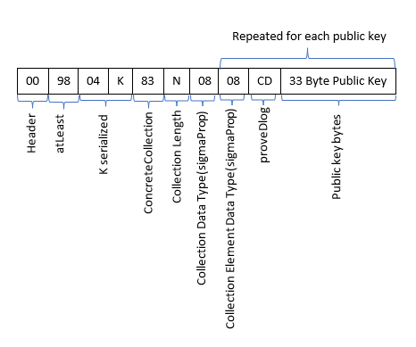

# EIP-41: Multi-Signature Wallet

- Author: lazypinkpatrick, vorujack, mhs_sam
- Status: Completed
- Created: 21-Jan-2023
- License: MIT
- Forking: not needed

This EIP defines a standard for multi-signature wallets based on EIP-11, which defines the multi-signature signing process.

## Introduction

On top of EIP-11, this EIP implements the following additional operations:

* Wallet creation and address derivation.
* Transaction signing based on EIP-11.

## Wallet Creation and Address Derivation

These parameters define an `N-out-of-M` multi-signature wallet:

* `M`: number of public keys.
* `N`: minimum signature required.

Each signer stores the set of extended public keys of all signers and a local copy of their secret.

An address is derived for each signer using their extended public key over a specified derivation path. The list of derived addresses for all signers is then used to compile a multi-sig contract that looks like this:

```
atLeast(
  N,
  Coll(
    PK(Address1),
    PK(Address2),
    .
    .
    .
    PK(AddressM)
  )
)
```

Please note, this contract results in different addresses when the order of signers differs.

We must guarantee that all signers will have a unique and reproducible multi-signature wallet address. To do so, we use the same derivation path and sort the byte array of public keys in ascending order.

Then we will manually create the ErgoTree; since using the compiler could cause the resulting address to vary.

The address derivation algorithm is as follows:

Sort the list of signers' public keys before being used in the contract.
Create the required ergoTree array as follows:

- The first byte in the array is `10`.
- The number of constant values in the contract is encoded as a variable-length quantity (VLQ).
  This number equals `M+1` (Constant `N` and `M` public keys)
- A byte with value `04` denotes the integer type,followed by the value of `N` encoded as VLQ.
- For each public key 35 bytes are used: 2 bytes with value `08cd`, followed by 33 bytes representing the public key.
- A byte with the value `98` indicates **"atLeast"**.
- Two bytes, with values `73` and `00`, respectively.
  The value `00` indicates the VLQ-encoded index of value `N` in the list of constants.
- A constant byte with value `83`, the VLQ-encoded value of `M`, and a constant byte with value `08`
- For each public key (`M` times), a byte with value `73`,followed by the VLQ-encoded value of the index of the public key in the list of constants

Therefore, for each derivation path, all wallets are able to generate a unique and similar byte array as an ErgoTree.



## Transaction Signing

An unsigned transaction is generated on one wallet. This transaction may have been generated through ErgoPay or the dApp connector, or it could be an outgoing transaction to another address through the wallet itself.

After an unsigned transaction is generated, the wallet

Generates a commitment.
Stores its private part locally.
Shares a commitment as below

```
{
  tx:<reduced transaction bytes encoded as base64>,
  boxes:[encoded boxes as base64],
  commitment: commitments encoded
}
```

The input `boxes:` are only used to display transactions on wallets.

The general commitment format is as follows. However, this general-purpose commitment can be used for any contract.
```
{
    "hint": "cmtReal",
    "position": "0-0",
    "type": "dlog",
    "pubkey": {
      "op": "205",
      "h": "03a73c66970f14fc6450c6ab1a167cb4ba3baa64b20f731e22ec6840c70d27ef1c",
    }
    "a": "0253db866791af521ba4ab009509b6db89d272d9461636ee65eaa3e316884b21a4"
}
```

In a multi-signature wallet, a simplified version of commitment is used.

```
commitments: [
  [<base64 string of commitment for public key index 0 in input 0>, ...]
  [<base64 string of commitment for public key index 0 in input 1>, ...]
]
```

In the multi-signature wallet, a commitment is represented as a list of base64 strings to reduce the commitment size. Also, an empty string is used wherever a commitment is unavailable.

[//]: # (and we can transform these commitments to standard format:)
This reduced format can be transformed into the standard format:

```
{
    "hint": "cmtReal",
    "position": "0-<commitment_index>",
    "type": "dlog",
    "pubkey": {
        "op": "205",
        "h": "<public key used in address generation at index commitment_index>"
    },
    "a": "<base16 encoded of commitment at index commitment_index>"
}
```

[//]: # (Because wallets want to pass this code via QRCode, each wallet can split it into chunks)

To transfer these commitments using QRCode, we can split the data into several chunks:

```
{
   MSR: "{\"tx\": ...}",
   n: <number of chunks>
   p: <page number>
}
```

This data is transferred between multi-signature wallets until one wallet has at least `N` commitments (including its own).

This wallet creates a partially signed transaction with this encoding:

```
{
    partialTx: "<partially signed transaction encoded as base64>",
    commitments: <ancoded commitments>
    signed: [<base64 encoded of signed public keys>],
    simulated: [<base64 encoded of simulated public keys>],
}
```

It can also be transferred using QRCode in several chunks:

```
{
    MTX: "{\"partialTx\": ... }",
    n: <number of chunks>
    p: <page number>
}
```

The first signer creates a list of simulated signers, and other signers use this list.

Each signer:
Signs the partially signed transaction (if they still need to).
Adds their public key to the list.
Shares the data with the next signer.

The transaction will be broadcasted whenever the signer determines that the transaction has enough signatures. 


